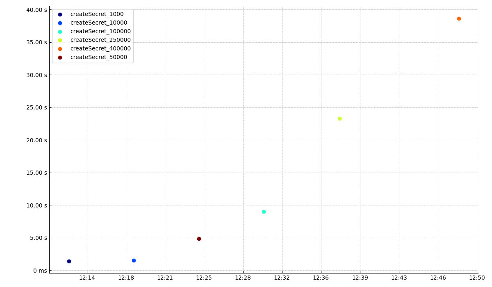

# Response times

## Summary

| group               | total | OK  | KO  | Min   | 50th pct | 75th pct | 95th pct | 99th pct | Max   | Mean  | Std Dev |
| ------------------- | ----- | --- | --- | ----- | -------- | -------- | -------- | -------- | ----- | ----- | ------- |
| createSecret_1000   | 1     | 1   | 0   | 1439  | 1439     | 1439     | 1439     | 1439     | 1439  | 1439  | nan     |
| createSecret_10000  | 1     | 1   | 0   | 1527  | 1527     | 1527     | 1527     | 1527     | 1527  | 1527  | nan     |
| createSecret_50000  | 1     | 1   | 0   | 4895  | 4895     | 4895     | 4895     | 4895     | 4895  | 4895  | nan     |
| createSecret_100000 | 1     | 1   | 0   | 9023  | 9023     | 9023     | 9023     | 9023     | 9023  | 9023  | nan     |
| createSecret_250000 | 1     | 1   | 0   | 23295 | 23295    | 23295    | 23295    | 23295    | 23295 | 23295 | nan     |
| createSecret_400000 | 1     | 1   | 0   | 38655 | 38655    | 38655    | 38655    | 38655    | 38655 | 38655 | nan     |
