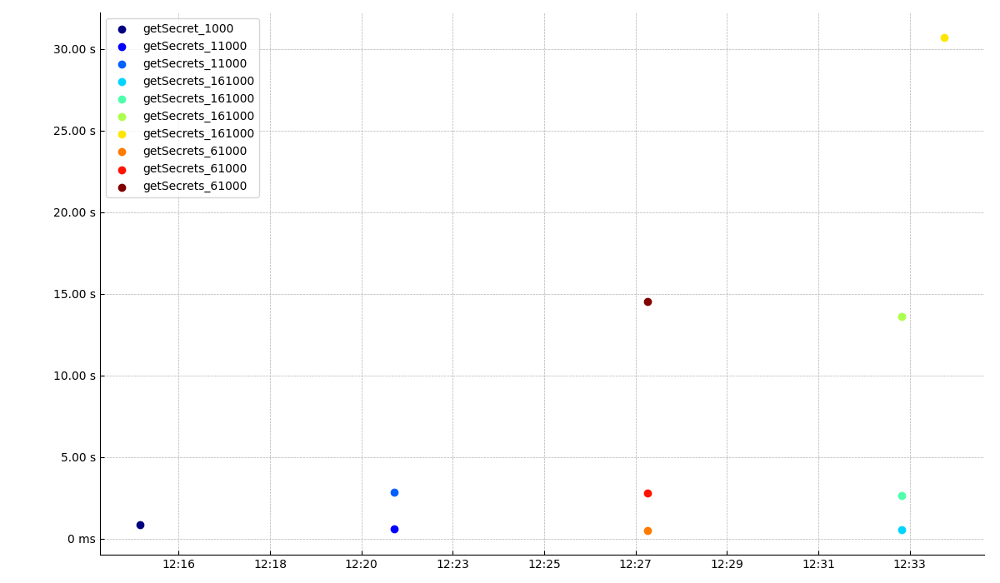

# Response times

## Summary

| group            | total | OK  | KO  | Min | 50th pct | 75th pct | 95th pct | 99th pct | Max   | Mean  | Std Dev |
| ---------------- | ----- | --- | --- | --- | -------- | -------- | -------- | -------- | ----- | ----- | ------- |
| getSecret_1000   | 1     | 1   | 0   | 847 | 847      | 847      | 847      | 847      | 847   | 847   | nan     |
| getSecret_11000  | 1     | 1   | 0   | 611 | 1721     | 2276     | 2720     | 2808     | 2831  | 1721  | 1569    |
| getSecret_61000  | 1     | 1   | 0   | 519 | 2815     | 8671     | 13355    | 14292    | 14572 | 5953  | 7512    |
| getSecret_161000 | 1     | 1   | 0   | 547 | 8143     | 17903    | 28155    | 30206    | 30719 | 11888 | 13802   |
